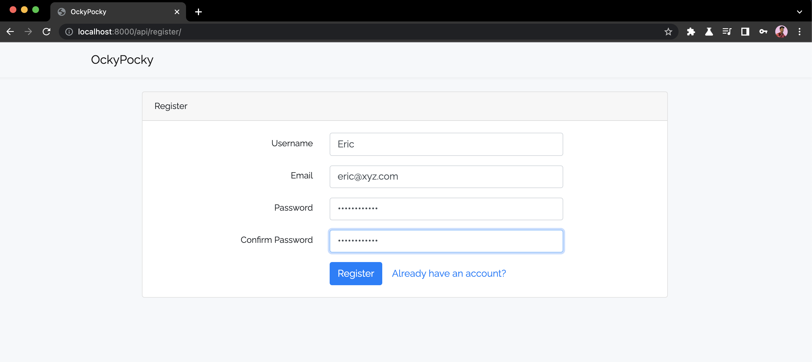
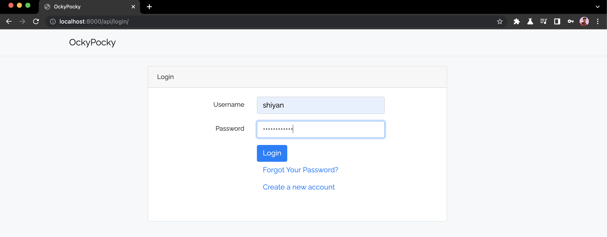

# OckyPocky Assessment

### Python/Django Development Internship

Please do the assignment using the Django framework in python.
Create a Website Login flow using Authentication.

- Create the Rest api for the User Sign up , Login , update password, forgot, reset password.
- Develop a single responsive webpage.
  P.S. You can use any frontend library / framework.

`Submission deadline: 18 October, 2021`

## API Reference

#### Register user

```http
  POST /api/register/
```

| form-data   | value    | Description          |
| :---------- | :------- | :------------------- |
| `username`  | `string` | **unique username**  |
| `email`     | `string` | **email id**         |
| `password1` | `string` | **password**         |
| `password2` | `string` | **confirm password** |

#### Login user

```http
  POST /api/login/
```

| form-data  | value      | Description  |
| :--------- | :--------- | :----------- |
| `username` | `string`   | **username** |
| `password` | `password` | **password** |

#### Logout

Logs out the user.

```http
  GET /api/logout/
```

#### Forgot Password

Opens a form to reset password linked to the email.

```http
  GET /api/reset_password/
```

#### Update Password

Opens a form to update the current password to a new password.

```http
  GET /api/update_password/
```

## Run Locally

Clone the project

```bash
 $ git clone https://github.com/shiyanshirani/OckyPocky-task.git
```

Go to the project directory

```bash
 $ cd OckyPocky-task
```

Install dependencies

```bash
 $ pip3 install -r requirements.txt
```

Go to the Django Project folder

```bash
 $ cd OckyPocky
```

Make migrations and migrate

```bash
 $ python3 manage.py makemigrations
 $ python3 manage.py migrate
```

Run server locally

```bash
 $ python3 manage.py runserver
```

## Screenshots




## Tech Stack

**Server:** Python, Django, Djano-Rest-Framework\
**Client:** Bootstrap, CSS, HTML

## License

[MIT](https://choosealicense.com/licenses/mit/)
